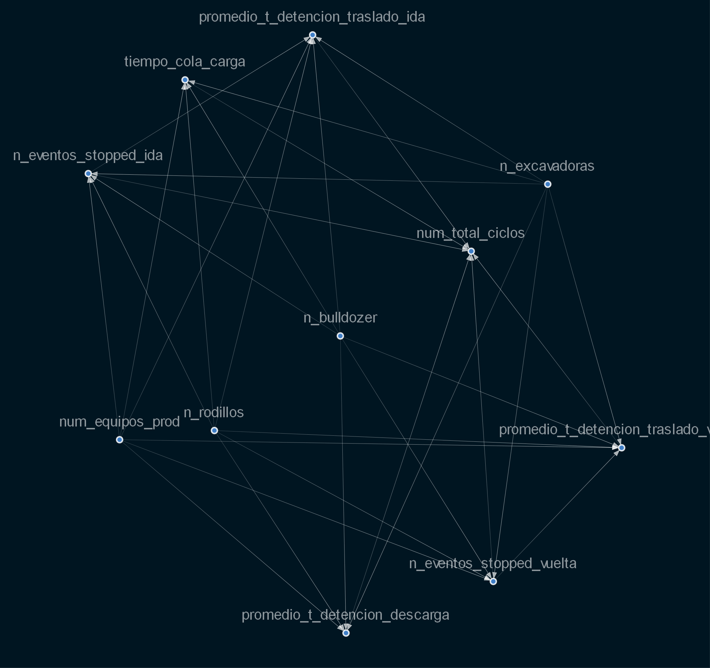

# bayesian-net


# causalnex

Ejemplo del uso de causalnex, para tener un ejemplo por si en un futuro lo necesito, entrenamiento de una red bayesiana e inferencia (counterfactuals) a preguntas que tenía el cliente del funcionamiento de la faena.

## Organización del repositorio

```sh
│   .gitignore
│   README.md
│   requirements.txt
├───codes
│   ├───bayesian-network
│   │       domain_expertise.py    ----> Red bayesiana desde experiencia del PO
│   │       from_data.py           ----> Red bayesiana desde los datos
│   └───scm
│           direct_acyclic_graph.py
├───data
│   └───mine
│           ads_combined.pkl
│           correlations.xlsx
├───documents
├───results
│   └───graphs
│           correlations.png
│           correlations_simple_case.png
│           from_data1.png
│           from_data11.png
│           from_data2.png
│           from_data22.png
│           from_data33.png
│           funcionamiento_logico.png
│           graph_causal.png
└───src
    ├───analytics
    │       metrics.py
    │       transformations.py
    │       __init__.py
    ├───config
    │       config.py
    ├───eda
    │       exploratory_data_analysis.py
    │       __init__.py
    ├───preprocessing
    │       cleaning.py
    │       discretizer.py
    │       preprocessing.py
    │       __init__.py
    └───utils
            utils.py
            visualizations.py
            __init__.py

```
## Librerias necearias

```sh
$ git clone https://github.com/matheus695p/causalnex.git
$ cd causalnex
$ pip install -r requirements.txt

```
# Caso de minería 

Para empezar se hizo un análisis de correlaciones para ver la relación entre las variables (pearson, spearman, kendall) con esto me fije en las variables,
que tenían correlación para construir las hipotesis de causalidad.

Este es el grafo de la operación, en donde se busca hacer counterfactuals a la red una vez entrenada, resolviendo preguntas que tenía el PO, ver, para entender las preguntas.

```sh
├───codes
│   ├───bayesian-network
│   │       domain_expertise.py 
```

directed acyclic graph construido por el cliente, de como el cree que se afectan los kpi's en el botadero.


<p align="center">
  
</p>


<p align="center">
  
</p>


Los resultados de los counterfactuals quedan privados, pero queda el método de como hacerlos una vez discretizados los datos :).


# Apunte de estudio

## Redes Bayesianas

Ventajas e inconvenientes de las redes bayesianas Ventajas (desde la documentación de causalnex)

Ventajas:

* Las redes bayesianas ofrecen una representación gráfica que es razonablemente interpretable y fácilmente explicable
* Las relaciones capturadas entre variables en una red bayesiana son más complejas pero, con suerte, más informativas que un modelo convencional
* Los modelos pueden reflejar simultáneamente información estadísticamente significativa (aprendida de los datos) y experiencia en el dominio
* Se pueden utilizar múltiples métricas para medir la importancia de las relaciones y ayudar a identificar el efecto de acciones específicas
* Ofrece un mecanismo para sugerir counterfactual actions y combinar acciones sin supuestos agresivos de independencia de las variables.


Desventajas:


* Es posible que la granularidad del modelado tenga que ser menor. Sin embargo, esto puede no ser necesario o puede ejecutarse en tangente a otras técnicas que proporcionan precisión pero son menos interpretables
* La complejidad computacional es mayor. Sin embargo, esto puede compensarse con una selección cuidadosa de funciones y una política de discretización menos granular, pero a expensas del poder predictivo
* Esta no es (desafortunadamente) una forma de automatizar completamente la inferencia causal.


## Taxonomía de los métodos de interpretabilidad 

Los métodos para la interpretabilidad del machine learning se pueden clasificar según varios criterios.

¿Intrínseco o post hoc? (Intrinsic or post hoc? )
Este criterio distingue si la interpretabilidad se logra restringiendo la complejidad del modelo de aprendizaje automático (intrínseco) o aplicando métodos que analizan el modelo después del entrenamiento (post hoc). La interpretabilidad intrínseca se refiere a modelos de aprendizaje automático que se consideran interpretables debido a su estructura simple, como árboles de decisión cortos o modelos lineales dispersos. La interpretabilidad post hoc se refiere a la aplicación de métodos de interpretación después del entrenamiento del modelo. La importancia de la característica de permutación es, por ejemplo, un método de interpretación post hoc. Los métodos post hoc también se pueden aplicar a modelos intrínsecamente interpretables. Por ejemplo, la importancia de la característica de permutación se puede calcular para árboles de decisión. 

Resultado del método de interpretación Los distintos métodos de interpretación se pueden diferenciar a grandes rasgos según sus resultados.

- Feature summary statistic: Muchos métodos de interpretación proporcionan estadísticas de resumen para cada característica. Algunos métodos devuelven un solo número por característica, como la importancia de la característica, o un resultado más complejo, como las fortalezas de interacción de características por pares, que consisten en un número para cada par de características.

- Feature summary visualization: La mayoría de las estadísticas de resumen de funciones también se pueden visualizar. Algunos resúmenes de funciones solo son significativos si se visualizan y una tabla sería una elección incorrecta. La dependencia parcial de una característica es tal caso. Los gráficos de dependencia parcial son curvas que muestran una característica y el resultado promedio previsto. La mejor manera de presentar dependencias parciales es dibujar la curva en lugar de imprimir las coordenadas.

- Model internals (por ejemplo, pesos aprendidos): La interpretación de modelos intrínsecamente interpretables cae en esta categoría. Algunos ejemplos son los pesos en modelos lineales o la estructura de árbol aprendida (las características y umbrales utilizados para las divisiones) de árboles de decisión. Las líneas están borrosas entre los componentes internos del modelo y la estadística de resumen de características en, por ejemplo, modelos lineales, porque los pesos son tanto internos del modelo como estadísticas de resumen para las características al mismo tiempo. Otro método que genera los componentes internos del modelo es la visualización de detectores de características aprendidos en redes neuronales convolucionales. Los métodos de interpretabilidad que generan los componentes internos del modelo son, por definición, específicos del modelo (consulte el siguiente criterio).

- Data point: esta categoría incluye todos los métodos que devuelven puntos de datos (ya existentes o creados recientemente) para hacer que un modelo sea interpretable. Un método se llama counterfactual explanations. Para explicar la predicción de una instancia de datos, el método encuentra un punto de datos similar cambiando algunas de las características para las que el resultado predicho cambia de manera relevante (por ejemplo, un cambio en la clase predicha). Otro ejemplo es la identificación de prototipos de clases predichas. Para ser útiles, los métodos de interpretación que generan nuevos puntos de datos requieren que los mismos puntos de datos puedan interpretarse. Esto funciona bien para imágenes y textos, pero es menos útil para datos tabulares con cientos de funciones.

¿Modelo específico o agnóstico del modelo? Las herramientas de interpretación específicas del modelo están limitadas a clases de modelos específicas. La interpretación de las ponderaciones de regresión en un modelo lineal es una interpretación específica del modelo, ya que, por definición, la interpretación de los modelos intrínsecamente interpretables es siempre específica del modelo. Herramientas que solo funcionan para la interpretación de p. Ej. Las redes neuronales son específicas del modelo. Las herramientas agnósticas del modelo se pueden usar en cualquier modelo de aprendizaje automático y se aplican después de que el modelo haya sido entrenado (post hoc). Estos métodos agnósticos suelen funcionar analizando pares de entrada y salida de características. Por definición, estos métodos no pueden tener acceso a los componentes internos del modelo, como los pesos o la información estructural.

## Modelos interpretables
Acá la lista de modelos interpretables 


## Model Agnostic Methods

Separar las explicaciones del modelo de ml (métodos de interpretación agnostic-model) tiene algunas ventajas. La gran ventaja de los métodos de interpretación independientes del modelo sobre los específicos del modelo es su flexibilidad. Los desarrolladores de ml son libres de usar cualquier modelo de aprendizaje automático que les guste cuando los métodos de interpretación se pueden aplicar a cualquier modelo.
Todo lo que se base en una interpretación de un modelo de aprendizaje automático, como una interfaz gráfica o de usuario, también se vuelve independiente del modelo de aprendizaje automático subyacente. Por lo general, no solo uno, sino muchos tipos de modelos de aprendizaje automático se evalúan para resolver una tarea, y cuando se comparan modelos en términos de interpretabilidad, es más fácil trabajar con explicaciones independientes del modelo, ya que el mismo método se puede usar para cualquier tipo. del modelo.

Una alternativa a los métodos de interpretación independientes del modelo es usar solo modelos interpretables, los que están más arriba, lo que a menudo tiene la gran desventaja de que el rendimiento predictivo se pierde en comparación con otros modelos y se limita a un tipo de modelo.
La otra alternativa es utilizar model-specific-interpretations. La desventaja de esto es que también lo vincula a un tipo de modelo y será difícil cambiar a otro.

Los aspectos deseables de un sistema de model-agnostic:

- Flexibilidad del modelo: El método de interpretación puede funcionar con cualquier modelo de aprendizaje automático, como bosques aleatorios y redes neuronales profundas.
- Flexibilidad de la explicación: No está limitado a una determinada forma de explicación. En algunos casos puede resultar útil tener una fórmula lineal, en otros casos un gráfico con características importantes.
- Flexibilidad de representación: El sistema de explicación debería poder utilizar una representación de características diferente al modelo que se explica.


# Fuentes

- documents/ --> carpeta con papers y libros de interpretabilidad
- https://christophm.github.io/interpretable-ml-book/taxonomy-of-interpretability-methods.html
- https://docs.seldon.io/projects/alibi/en/stable/methods/CF.html
- https://github.com/amirhk/mace
